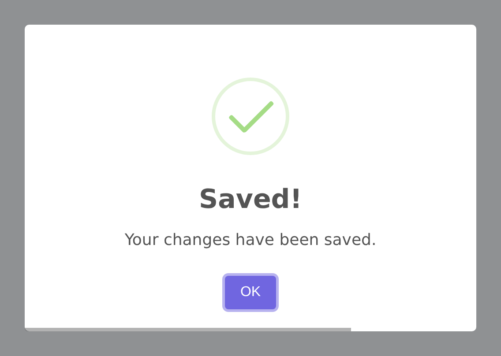
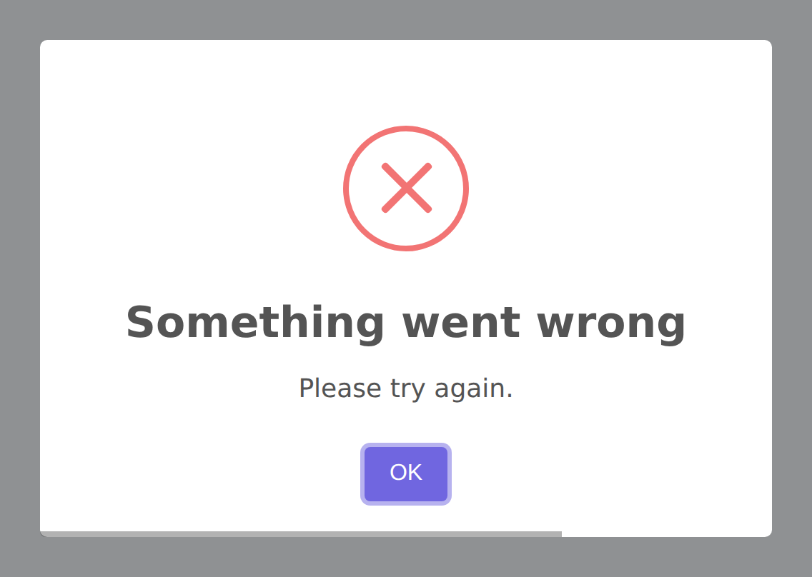
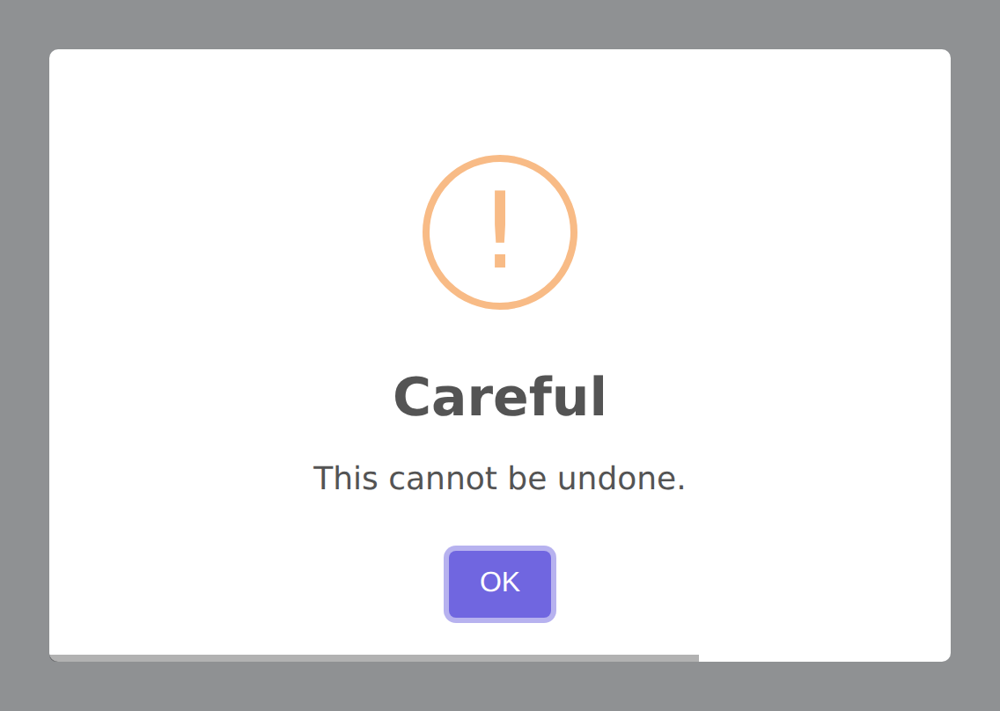
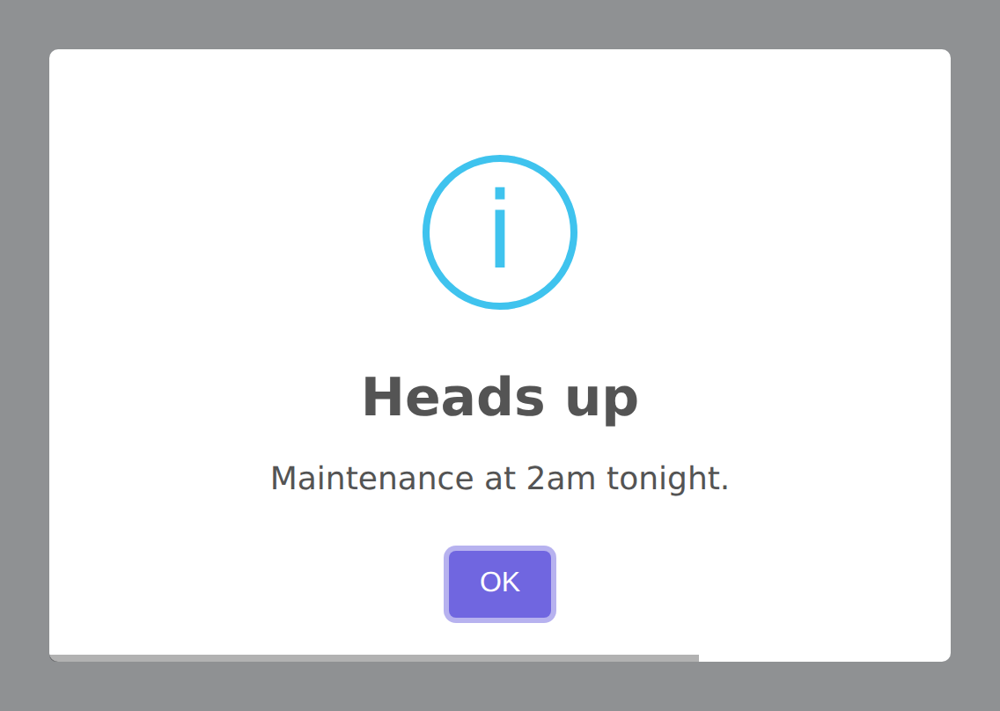
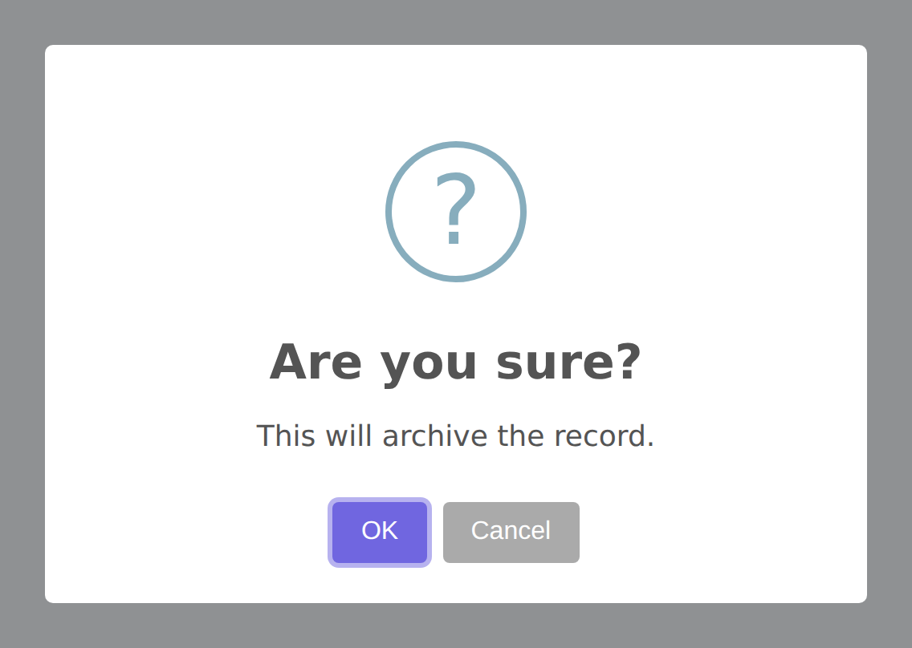
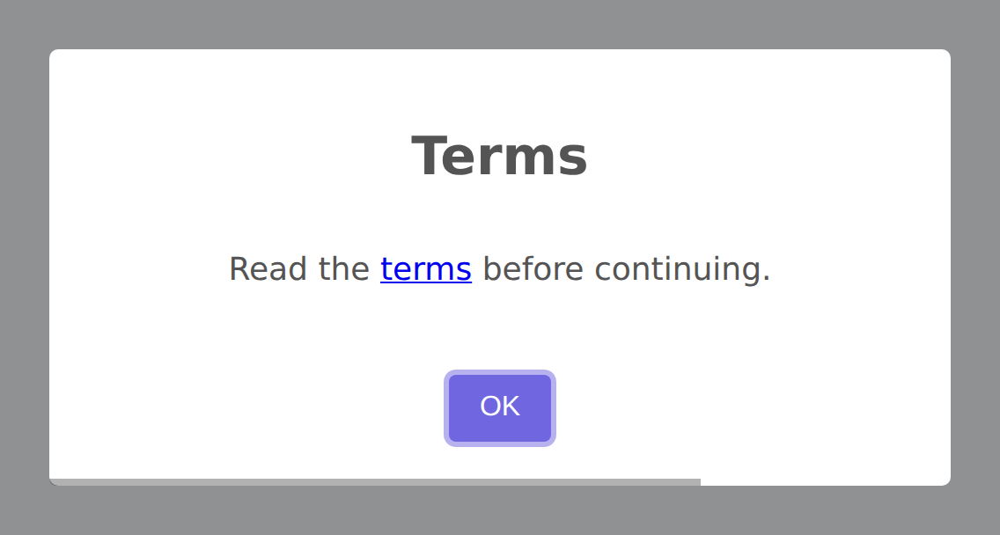

# Alerts

Alerts are the most common type of SweetAlert2 dialog. The `AlertBuilder` provides a fluent, chainable API for building modal alerts with any combination of title, text, icon, buttons, and customization options.

## Basic Alert

Every alert starts with the `Alert` facade. At minimum, set a title and call `flash()` to push the configuration to the session:

```php
use RealRashid\SweetAlert\Facades\Alert;

Alert::title('Hello World')->flash();
```

This renders a basic modal with the title and a default "OK" confirm button.

## Alert Types (Icons)

SweetAlert2 supports five icon types, each available as a fluent method on the builder. Calling an icon method sets the icon and returns the builder for continued chaining:

```php
// Success
Alert::title('Done!')->success()->flash();

// Error
Alert::title('Oops!')->error()->flash();

// Warning
Alert::title('Careful!')->warning()->flash();

// Info
Alert::title('FYI')->info()->flash();

// Question (also auto-shows cancel button)
Alert::title('Are you sure?')->question()->flash();
```

### With Title and Text Shorthand

Each icon method accepts optional `$title` and `$text` parameters for conciseness:

```php
Alert::success('Created!', 'The post has been created.')->flash();
Alert::error('Failed!', 'Something went wrong.')->flash();
Alert::warning('Warning!', 'You are about to do something risky.')->flash();
Alert::info('Note', 'Please read the instructions.')->flash();
Alert::question('Confirm?', 'Do you want to proceed?')->flash();
```

This is equivalent to calling `title()`, `text()`, and the icon method separately — it's just a shorthand for the most common pattern.

### Using the AlertType Enum

For type safety and IDE autocompletion, you can use the `AlertType` enum:

```php
use RealRashid\SweetAlert\Enums\AlertType;

Alert::title('Done!')
    ->icon(AlertType::Success)
    ->flash();
```

The enum values are: `Success`, `Error`, `Warning`, `Info`, `Question`.


## What They Look Like

Each icon type renders through SweetAlert2 like this:

| | |
| :-: | :-: |
|  |  |
| `Alert::success('Saved!', 'Your changes have been saved.')` | `Alert::error('Something went wrong', 'Please try again.')` |
|  |  |
| `Alert::warning('Careful', 'This cannot be undone.')` | `Alert::info('Heads up', 'Maintenance at 2am tonight.')` |



```php
Alert::question('Are you sure?', 'This will archive the record.');
```

Note that `question()` adds a cancel button, since a question with only one
answer is not really a question.

## Setting Text Content

Use `text()` for plain-text descriptions that appear below the title:

```php
Alert::title('Payment Received')
    ->text('Your transaction ID is #12345.')
    ->success()
    ->flash();
```

## HTML Content



Use `html()` instead of `text()` when you need rich formatting — links, bold text, lists, or any valid HTML:

```php
Alert::title('Order Summary')
    ->html('<p>Your order <b>#12345</b> has been shipped.</p><p>Track it <a href="#">here</a>.</p>')
    ->success()
    ->flash();
```

When you call `html()`, the `text` property is automatically removed from the configuration, since SweetAlert2 uses one or the other.

### Converting Text to HTML

If you've already set `text()` and want to switch to HTML mode, use `toHtml()`:

```php
Alert::title('Info')
    ->text('This is plain text')
    ->toHtml()  // Now treated as HTML content
    ->flash();
```

## Blade Views as Content

For complex HTML content, render a Blade view directly into the alert using `view()`:

```php
Alert::title('Invoice')
    ->view('invoices.summary', ['invoice' => $invoice])
    ->success()
    ->flash();
```

This renders the `resources/views/invoices/summary.blade.php` view and injects its HTML output into the alert's `html` property. All Blade features — `@foreach`, `@if`, components, and more — work as expected.

## The `flash()` Method

An alert is stored in the session and shown on the next response. Whether you
call `flash()` yourself depends on how you started the chain.

### Shortcuts show themselves

The icon shortcuts show an alert on their own, exactly as they always have:

```php
Alert::success('Saved!', 'Your changes have been saved.');

return redirect()->route('posts.index');
```

That is one line in a controller and nothing else to remember. It applies to
`success()`, `error()`, `warning()`, `info()`, `question()`, `alert()`,
`toast()` and `confirmDelete()`.

Carrying on from one of those keeps the alert in step, so this works too:

```php
Alert::success('Saved!')->autoClose(3000);
```

### Composed chains wait for you

Start with `make()` and nothing reaches the session until you say so:

```php
Alert::make()
    ->success('Order placed')
    ->position('top-end')
    ->autoClose(6000)
    ->timerProgressBar()
    ->flash();
```

Use this when the alert is built up over several lines, or conditionally, and
you would rather decide when it is shown.

::: tip `flash()` is always safe
Calling it on an alert that has already flashed overwrites the same session key
rather than queuing a second alert. If you are unsure, or you are copying an
example, leaving `->flash()` on the end does no harm.
:::

### What it actually does

`flash()` serialises the configuration to JSON under the session's
`alert.config` key. On the next response, `@sweetAlert` reads it and hands it to
`Swal.fire()`.

::: important
The data is stored in the session flash, so it is available on the **next**
request only. Show the alert before you redirect, not after.
:::

## Confirm Dialog

The `confirm()` method creates a two-button dialog that reads its defaults from the `sweetalert.confirm` config block (question icon, blue confirm button, cancel button shown):

```php
Alert::confirm('Are you sure?', 'This action cannot be undone.')->flash();
```

Override any defaults per-call using the fluent API:

```php
Alert::confirm('Proceed?')
    ->confirmButton('Yes, proceed', '#28a745')
    ->cancelButton('No, go back', '#6c757d')
    ->flash();
```

::: tip confirm vs confirmDelete
`Alert::confirm()` uses `sweetalert.confirm` defaults (question icon, blue button).
`Alert::confirmDelete()` uses `sweetalert.confirm_delete` defaults (warning icon, red button, loader). Use `confirmDelete` for destructive actions.
:::

## Theme

Apply a SweetAlert2 theme to an individual alert without changing the global config:

```php
Alert::title('Dark Alert')
    ->success()
    ->theme('dark')
    ->flash();
```

Available themes: `light`, `dark`, `borderless`, `minimal`, `material-ui`, `bootstrap-4`, `wordpress-admin`. The default is controlled by `sweetalert.theme` in your config (default: `light`).

## Validation Messages

Show a custom validation message below the confirm button using `validationMessage()`. This is displayed when `preConfirm` fails (useful in pre-confirm route workflows):

```php
Alert::confirm('Enter your PIN', 'Please enter your 4-digit PIN to continue.')
    ->preConfirmRoute(route('verify-pin'))
    ->validationMessage('Invalid PIN. Please try again.')
    ->flash();
```

## Pre-Deny Route

When using a deny button with server-side confirmation, redirect to a specific route when denied using `preDenyRoute()`:

```php
Alert::title('Review required')
    ->question()
    ->confirmButton('Approve')
    ->denyButton('Reject')
    ->preDenyRoute(route('admin.reviews.reject', ['review' => $review->id]))
    ->flash();
```

## Preset

Apply a named preset from `sweetalert.presets` in your config to reuse a canned configuration:

```php
// config/sweetalert.php
'presets' => [
    'danger' => [
        'icon' => 'error',
        'confirmButtonColor' => '#d33',
        'timer' => 8000,
    ],
],
```

```php
Alert::title('Something went wrong')
    ->preset('danger')
    ->flash();
```

Per-call methods called after `preset()` will override the preset values.

## Complete Example

Here's a comprehensive example showing the full range of alert options:

```php
use RealRashid\SweetAlert\Facades\Alert;
use RealRashid\SweetAlert\Enums\Position;

Alert::title('Profile Updated')
    ->success()
    ->text('Your profile changes have been saved.')
    ->showCloseButton()
    ->confirmButton('Great!', '#28a745')
    ->position(Position::Center)
    ->timer(8000)
    ->timerProgressBar()
    ->footer('<a href="/profile">View your profile</a>')
    ->flash();
```
