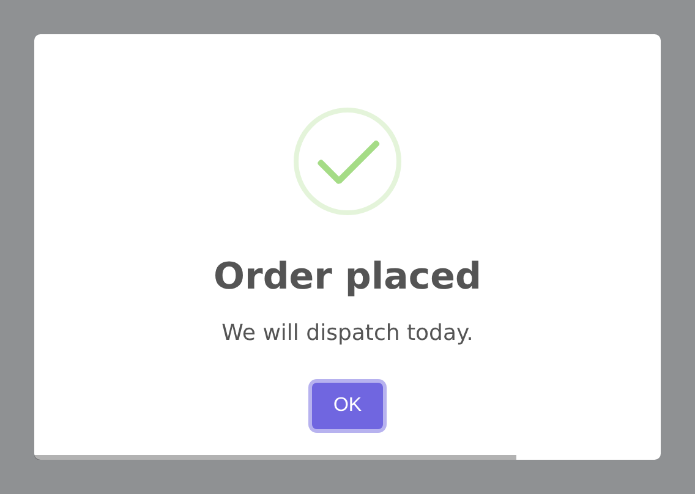

# Conditionals and Macros

Two small things that make a chain read the way you meant it.

## Conditionals

An alert often depends on something. The obvious way is an `if` around the
chain, which breaks it in half:

```php
$alert = Alert::success('Record saved');

if ($user->isAdmin()) {
    $alert->text('Audit log updated.');
}

$alert->flash();
```

`when()` keeps it in one piece:

```php
Alert::success('Record saved')
    ->when($user->isAdmin(), fn ($alert) => $alert->text('Audit log updated.'))
    ->flash();
```

`unless()` is the inverse:

```php
Alert::success('Saved')
    ->unless($request->wantsJson(), fn ($alert) => $alert->autoClose(3000))
    ->flash();
```

Both return the builder whichever way the condition falls, so the chain never
breaks.

They work on every builder:

```php
Alert::toast('Saved')
    ->when($isMobile, fn ($toast) => $toast->position('bottom-end'))
    ->flash();

Alert::input('Your name?')
    ->when($optional, fn ($input) => $input->autoClose(9000))
    ->flash();
```

## Macros

If the same handful of options appears everywhere, teach the builder once.
Register macros in a service provider:

```php
use RealRashid\SweetAlert\Builders\AlertBuilder;
use RealRashid\SweetAlert\Builders\ToastBuilder;

public function boot(): void
{
    AlertBuilder::macro('branded', function () {
        return $this->position('top-end')
            ->autoClose(4000)
            ->timerProgressBar();
    });

    ToastBuilder::macro('corner', fn () => $this->position('bottom-start'));
}
```

Then use them anywhere in a chain:

```php
Alert::success('Saved')->branded()->flash();

Alert::toast('Uploaded')->corner()->flash();
```

A macro can sit at any point — before or after the alert type — because it
returns the builder like everything else:

```php
Alert::make()->branded()->success('Saved')->flash();
```

::: tip Where to put your house style
A `branded()` macro is usually better than repeating four setters in thirty
controllers. Change the macro once and every alert follows.
:::

## A Real Example

```php
Alert::success('Order placed')
    ->branded()
    ->when($order->isRush(), fn ($alert) => $alert->text('We will dispatch today.'))
    ->unless($user->hasSeenTutorial(), fn ($alert) => $alert->footer('New here? See the guide.'))
    ->flash();
```

Every line reads as a decision, and nothing is wrapped in an `if`.



<br />
<p align="center"> <b>Made with ❤️ from Pakistan</b> </p>
