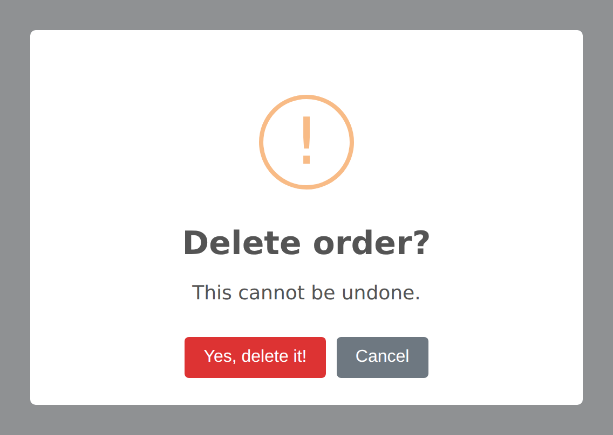

# Confirm & Delete

The confirm and delete dialog patterns are among the most common use cases for SweetAlert2 in Laravel applications — especially before destructive actions like deleting a record. The package provides dedicated methods that handle the entire flow, including form submission.

## Confirm Dialog

The `confirm()` method creates a two-button dialog with a warning icon and cancel button:




```php
Alert::confirm('Are you sure?', 'This action cannot be undone.')->flash();
```

This automatically configures:
- Warning icon
- Confirm button (text from config, default: "Yes, delete it!" with red color `#d33`)
- Cancel button (text from config, default: "Cancel")
- Timer removed (dialog stays until user interacts)

### Customizing Buttons

Override the default button text and colors:

```php
Alert::confirm('Proceed with checkout?')
    ->confirmButton('Yes, checkout', '#28a745')
    ->cancelButton('Cancel', '#6c757d')
    ->flash();
```

### Confirm with Question Icon

The `question()` icon method automatically shows a cancel button, making it perfect for confirmation dialogs:

```php
Alert::title('Save changes?')
    ->question()
    ->text('You have unsaved changes.')
    ->confirmButton('Save', '#28a745')
    ->cancelButton('Discard')
    ->flash();
```

## Confirm Delete

The `confirmDelete()` method is a specialized version of `confirm()` that handles the full delete flow — including automatically creating and submitting a DELETE form when the user confirms. This is the most common pattern for resource deletion in Laravel.

### Basic Usage

```php
Alert::confirmDelete('Delete this post?')->flash();
```

This configures:
- Warning icon
- Confirm button: "Yes, delete it!" (red, `#d33`)
- Cancel button: "Cancel"
- Close button hidden
- Loader shown on confirm button during submission
- ESC key and outside click disabled (user must choose)
- Automatically flashes to session as `alert.delete` type

### With Description Text

```php
Alert::confirmDelete('Delete this post?', 'This action is irreversible.')->flash();
```

### In Your Blade View

Add the `data-confirm-delete` attribute to any link that should ask before it
deletes. Nothing has to be flashed first — the confirmation works on every page
load:

```blade
<a href="{{ route('posts.destroy', $post) }}" data-confirm-delete>
    Delete Post
</a>
```

::: tip Changed in v8
In v7 the listener was only rendered on the request where `confirmDelete()` had
been flashed. On any other render — a refresh, a page reached from elsewhere —
the same link was an ordinary link, so the browser simply opened the URL with a
GET. In v8 the listener is always there and its defaults come from the config,
so a guarded link is guarded everywhere.
:::

### Customising One Link

Override the copy per element without touching the config:

```blade
<a href="{{ route('posts.destroy', $post) }}"
   data-confirm-delete
   data-confirm-title="Delete “{{ $post->title }}”?"
   data-confirm-text="This cannot be undone."
   data-confirm-button="Yes, delete it">
    Delete Post
</a>
```

### In a Controller

You can still flash `confirmDelete()` to customise the dialog for one request.
It overrides the defaults for that render only:

```php
public function edit(Post $post)
{
    Alert::confirmDelete('Delete this post?', $post->title)->flash();

    return view('posts.edit', compact('post'));
}
```

When the user clicks this link:
1. The click event is intercepted (the default navigation is prevented)
2. The SweetAlert2 confirm dialog is shown
3. If the user clicks "Yes, delete it!", a hidden `<form>` is created with `method="POST"` and `_method=DELETE`, including the CSRF token
4. The form is submitted to the link's `href` URL
5. This triggers your Laravel `destroy()` controller method as a normal DELETE request

No additional JavaScript is required — the Blade view handles everything automatically.

## Confirming Anything Else

`data-confirm` guards any action, not just deletes. Set the method you need:

```blade
<a href="{{ route('posts.publish', $post) }}" data-confirm data-confirm-method="PUT">
    Publish
</a>
```

Forms work the same way — put the attribute on the form and it asks before it
submits:

```blade
<form method="POST" action="{{ route('orders.refund', $order) }}" data-confirm
      data-confirm-title="Refund this order?">
    @csrf
    <button type="submit">Refund</button>
</form>
```

Defaults for these come from the `confirm` block in `config/sweetalert.php`, and
the same `data-confirm-title`, `data-confirm-text`, `data-confirm-icon`,
`data-confirm-button` and `data-confirm-cancel` attributes apply.

If you would rather wire confirmations up yourself, set `confirm.auto` to
`false` and the listener is not rendered at all.

## Sending the Answer to a Route

A dialog on its own only asks a question — the answer is gone the moment it
closes. `submitTo()` posts it to a route instead:

```php
Alert::input('What should we call you?')
    ->inputPlaceholder('Rashid Ali')
    ->submitTo(route('profile.name'), 'POST', 'name')
    ->flash();
```

On confirm the package builds a form with the CSRF token, the method you asked
for, and the typed value under the field name you gave, then submits it. Your
route receives an ordinary request:

```php
Route::post('/profile/name', function (Request $request) {
    auth()->user()->update(['name' => $request->input('name')]);

    Alert::success('Name updated');

    return back();
})->name('profile.name');
```

It works for any alert, not only inputs — on a plain confirm there is no value
to send, so the route just receives the confirmation.

### How It Works Under the Hood

The `@sweetAlert` directive renders a small listener on every page. When a
guarded element is clicked, or a guarded form is submitted, it:

1. Loads SweetAlert2 if the page has not already loaded it, so a page with only
   a guarded link ships no JavaScript until someone actually clicks
2. Reads the dialog options from the config, then from any `data-confirm-*`
   attributes on the element
3. Shows the confirmation
4. On confirm, builds a form carrying `@csrf` and the right `@method`, and
   submits it to the element's `href` — or submits the guarded form itself

If SweetAlert2 cannot be reached at all, the browser's own `confirm()` is used
instead. A guarded action never goes through unasked because a CDN was down.

### Customizing Delete Settings

The default text and colors for delete confirmations are configured in `config/sweetalert.php`:

```php
'confirm_delete' => [
    'icon' => 'warning',
    'confirm_button_text' => 'Yes, delete it!',
    'confirm_button_color' => '#d33',
    'cancel_button_text' => 'Cancel',
    'show_close_button' => false,
    'show_cancel_button' => true,
    'show_loader_on_confirm' => true,
],
```

Override any of these values to customize the default behavior across your entire application.

## Three-Way Confirm (with Deny Button)

For scenarios where users need three choices (e.g., Save / Don't Save / Cancel), use the deny button:

```php
Alert::title('Save changes before leaving?')
    ->question()
    ->confirmButton('Save', '#28a745')
    ->denyButton("Don't save", '#6c757d')
    ->cancelButton('Cancel')
    ->showCloseButton()
    ->flash();
```

In your frontend JavaScript, handle the deny result:

```javascript
Swal.fire({...}).then((result) => {
    if (result.isConfirmed) {
        // Save and proceed
    } else if (result.isDenied) {
        // Proceed without saving
    }
});
```

## Pre-Confirm with Async Validation

For confirmations that require server-side validation (e.g., checking if a resource can be deleted), use `preConfirmRoute()`:

```php
Alert::confirmDelete('Delete this user?')
    ->preConfirmRoute(route('users.can-delete', $user))
    ->flash();
```

Your route handler can prevent the deletion by returning a validation error:

```php
Route::post('/users/{user}/can-delete', function (User $user) {
    if ($user->hasActiveSubscriptions()) {
        return response()->json([
            'valid' => false,
            'message' => 'Cannot delete user with active subscriptions.',
        ]);
    }

    return response()->json(['valid' => true]);
})->name('users.can-delete');
```
