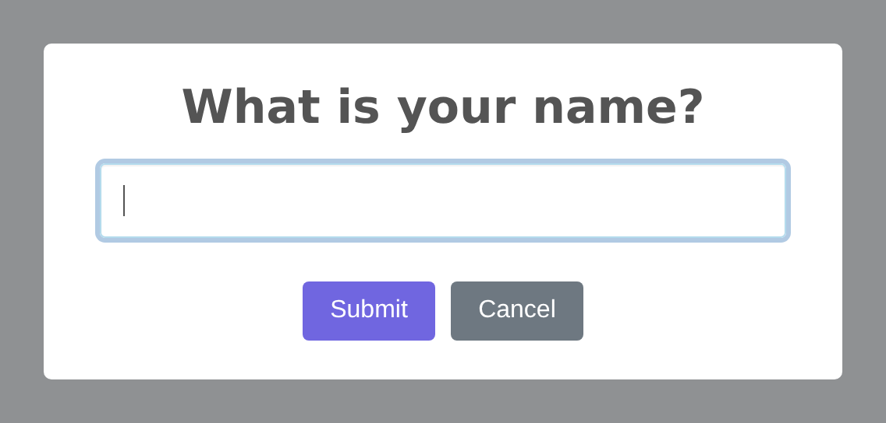

# Input Alerts

Input alerts are modal dialogs that prompt the user for input — text, email, password, selections, and more. The `InputBuilder` provides a fluent API for configuring all of SweetAlert2's input types with validation, placeholders, and server-side pre-confirm support.

## Creating an Input Alert

Use the `input()` method on the `Alert` facade. The first argument is the title, and the optional second argument is the input type (defaults to `text`):




```php
use RealRashid\SweetAlert\Facades\Alert;
use RealRashid\SweetAlert\Enums\InputType;

Alert::input('Enter your name', InputType::Text)
    ->inputPlaceholder('John Doe')
    ->confirmButton('Submit')
    ->flash();
```

## Supported Input Types

The `InputType` enum provides type-safe access to all SweetAlert2 input types:

| Enum Value | HTML Input | Description |
|---|---|---|
| `InputType::Text` | `<input type="text">` | Single-line text (default) |
| `InputType::Email` | `<input type="email">` | Email with validation |
| `InputType::Password` | `<input type="password">` | Masked password input |
| `InputType::Number` | `<input type="number">` | Numeric input with spinner |
| `InputType::Tel` | `<input type="tel">` | Telephone number |
| `InputType::Range` | `<input type="range">` | Slider control |
| `InputType::Textarea` | `<textarea>` | Multi-line text area |
| `InputType::Select` | `<select>` | Dropdown select menu |
| `InputType::Radio` | Radio buttons | Single-choice radio group |
| `InputType::Checkbox` | Checkbox | Toggle/binary choice |
| `InputType::File` | `<input type="file">` | File upload |
| `InputType::Url` | `<input type="url">` | URL with validation |
| `InputType::Color` | `<input type="color">` | Color picker |
| `InputType::Date` | `<input type="date">` | Date picker |
| `InputType::Time` | `<input type="time">` | Time picker |
| `InputType::Month` | `<input type="month">` | Month picker |
| `InputType::Week` | `<input type="week">` | Week picker |
| `InputType::Search` | `<input type="search">` | Search field |
| `InputType::DatetimeLocal` | `<input type="datetime-local">` | Date & time picker |

You can also pass input types as strings if you prefer:

```php
Alert::input('Enter your email', 'email')->flash();
Alert::input('Pick a date', 'date')->flash();
```

## Input Configuration Methods

### Placeholder

Set a placeholder for text-based inputs:

```php
Alert::input('Enter your email', InputType::Email)
    ->inputPlaceholder('user@example.com')
    ->flash();
```

### Default Value

Pre-fill the input with a default value using `inputValue()`:

```php
Alert::input('Your name', InputType::Text)
    ->inputValue(auth()->user()->name)
    ->flash();
```

### Options for Select and Radio

When using `select` or `radio` input types, provide options using `inputOptions()`. The array format determines how the options are displayed:

```php
// Simple key-value pairs
Alert::input('Select a country', InputType::Select)
    ->inputOptions([
        'US' => 'United States',
        'UK' => 'United Kingdom',
        'CA' => 'Canada',
        'AU' => 'Australia',
    ])
    ->flash();

// Grouped options
Alert::input('Select a city', InputType::Select)
    ->inputOptions([
        'North America' => [
            'NYC' => 'New York',
            'LA' => 'Los Angeles',
            'TOR' => 'Toronto',
        ],
        'Europe' => [
            'LON' => 'London',
            'PAR' => 'Paris',
            'BER' => 'Berlin',
        ],
    ])
    ->flash();
```

### HTML Attributes

Set custom HTML attributes on the input element using `inputAttributes()`:

```php
Alert::input('Username', InputType::Text)
    ->inputAttributes([
        'maxlength' => 20,
        'autocapitalize' => 'off',
        'spellcheck' => 'false',
    ])
    ->flash();
```

### Input Label

Add a visible label above the input field using `inputLabel()`:

```php
Alert::input('Email Address', InputType::Email)
    ->inputLabel('We will never share your email')
    ->inputPlaceholder('you@example.com')
    ->flash();
```

### Input CSS Class

Apply a custom CSS class to the input element:

```php
Alert::input('Search', InputType::Text)
    ->inputClass('form-control-lg')
    ->flash();
```

### Auto-Focus

Control whether the input receives focus automatically when the dialog opens (enabled by default):

```php
Alert::input('Optional note', InputType::Text)
    ->inputAutoFocus(false)
    ->flash();
```

### Auto-Trim

Control whether leading/trailing whitespace is automatically trimmed from the input value:

```php
Alert::input('Username', InputType::Text)
    ->inputAutoTrim(true)
    ->flash();
```

## Client-Side Validation

Use `inputValidator()` to display an error message when the user submits without entering a value:

```php
Alert::input('Required field', InputType::Text)
    ->inputValidator('This field is required!')
    ->flash();
```

When the user clicks the confirm button with an empty input, SweetAlert2 will display the validation message and prevent the dialog from closing.

::: tip
For more complex validation logic (like checking against a database), use the [Pre-Confirm Route](./pre-confirm) feature to validate on the server side.
:::

## Server-Side Validation (Pre-Confirm)

The `preConfirmRoute()` method sends the input value to a Laravel route via AJAX for server-side validation before the dialog closes:

```php
Alert::input('Enter promo code', InputType::Text)
    ->preConfirmRoute(route('validate-promo'))
    ->flash();
```

Your route handler should return a JSON response:

```php
// routes/web.php
Route::post('/validate-promo', function (Request $request) {
    $code = $request->input('value');

    if (! PromoCode::where('code', $code)->exists()) {
        return response()->json([
            'valid' => false,
            'message' => 'Invalid promo code',
        ]);
    }

    return response()->json([
        'valid' => true,
        'code' => $code,
    ]);
})->name('validate-promo');
```

If the response contains `"valid": false`, SweetAlert2 will display the `message` as a validation error and keep the dialog open.

## Complete Example

Here's a comprehensive example of an input alert with full customization:

```php
use RealRashid\SweetAlert\Facades\Alert;
use RealRashid\SweetAlert\Enums\InputType;
use RealRashid\SweetAlert\Enums\Position;

Alert::input('Enter your email', InputType::Email)
    ->text('We will send you a confirmation link.')
    ->inputPlaceholder('user@example.com')
    ->inputValue(old('email'))
    ->inputLabel('Email Address')
    ->inputAutoTrim(true)
    ->inputValidator('Please enter an email address')
    ->confirmButton('Subscribe', '#28a745')
    ->cancelButton('Maybe later')
    ->showCloseButton()
    ->position(Position::Center)
    ->animation('animate__fadeInDown', 'animate__fadeOutUp')
    ->flash();
```
