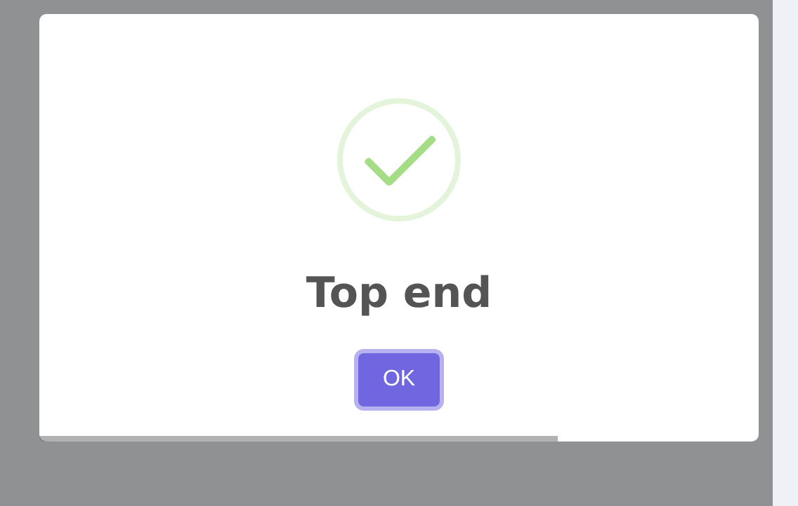

# Position

SweetAlert2 supports fifteen positions for placing dialogs and toasts on the screen. The `HasPosition` trait provides both a generic `position()` method and convenient shorthand methods for each position, including six physical aliases (`topLeft`, `topRight`, etc.).

## Using the Position Method

Pass a string or `Position` enum value to the `position()` method:




```php
use RealRashid\SweetAlert\Enums\Position;

Alert::title('Hello')
    ->position('top-end')
    ->flash();

Alert::title('Hello')
    ->position(Position::TopEnd)
    ->flash();
```

## Available Positions

| Enum Value | String Value | Location |
|---|---|---|
| `Position::Top` | `'top'` | Top center |
| `Position::TopStart` | `'top-start'` | Top left |
| `Position::TopEnd` | `'top-end'` | Top right |
| `Position::Center` | `'center'` | Center (default for modals) |
| `Position::CenterStart` | `'center-start'` | Center left |
| `Position::CenterEnd` | `'center-end'` | Center right |
| `Position::Bottom` | `'bottom'` | Bottom center |
| `Position::BottomStart` | `'bottom-start'` | Bottom left |
| `Position::BottomEnd` | `'bottom-end'` | Bottom right |
| `Position::TopLeft` | `'top-start'` | Alias for TopStart |
| `Position::TopRight` | `'top-end'` | Alias for TopEnd |
| `Position::CenterLeft` | `'center-start'` | Alias for CenterStart |
| `Position::CenterRight` | `'center-end'` | Alias for CenterEnd |
| `Position::BottomLeft` | `'bottom-start'` | Alias for BottomStart |
| `Position::BottomRight` | `'bottom-end'` | Alias for BottomEnd |

## Shorthand Methods

Every position has a shorthand method. The six physical aliases (`topLeft`, `topRight`, etc.) map to the same SweetAlert2 values as their `Start`/`End` counterparts:

```php
// Top positions
Alert::toast('Top center', 'info')->top()->flash();
Alert::toast('Top left', 'info')->topStart()->flash();
Alert::toast('Top right', 'info')->topEnd()->flash();
Alert::toast('Top left', 'info')->topLeft()->flash();    // alias for topStart
Alert::toast('Top right', 'info')->topRight()->flash();   // alias for topEnd

// Center positions
Alert::title('Centered')->center()->flash();
Alert::title('Center left')->centerStart()->flash();
Alert::title('Center right')->centerEnd()->flash();
Alert::title('Center left')->centerLeft()->flash();   // alias for centerStart
Alert::title('Center right')->centerRight()->flash();  // alias for centerEnd

// Bottom positions
Alert::toast('Bottom center', 'info')->bottom()->flash();
Alert::toast('Bottom left', 'info')->bottomStart()->flash();
Alert::toast('Bottom right', 'info')->bottomEnd()->flash();
Alert::toast('Bottom left', 'info')->bottomLeft()->flash();    // alias for bottomStart
Alert::toast('Bottom right', 'info')->bottomRight()->flash();   // alias for bottomEnd
```

## Default Positions

Different alert types have different default positions:

| Type | Default Position | Why |
|---|---|---|
| Modal alerts | `center` | Centered feels natural for important dialogs |
| Toast notifications | `top-end` | Top-right corner is the standard toast position |
| Input dialogs | `center` | Centered focuses attention on the input |

These defaults are configured in `config/sweetalert.php` and can be changed globally:

```php
// config/sweetalert.php
'toast' => [
    'position' => 'bottom-end',  // Changed from top-end
],
```

## Example: Toast at Bottom Right

```php
use RealRashid\SweetAlert\Facades\Alert;

Alert::toast('Item added to cart', 'success')
    ->bottomEnd()
    ->autoClose(3000)
    ->flash();
```
