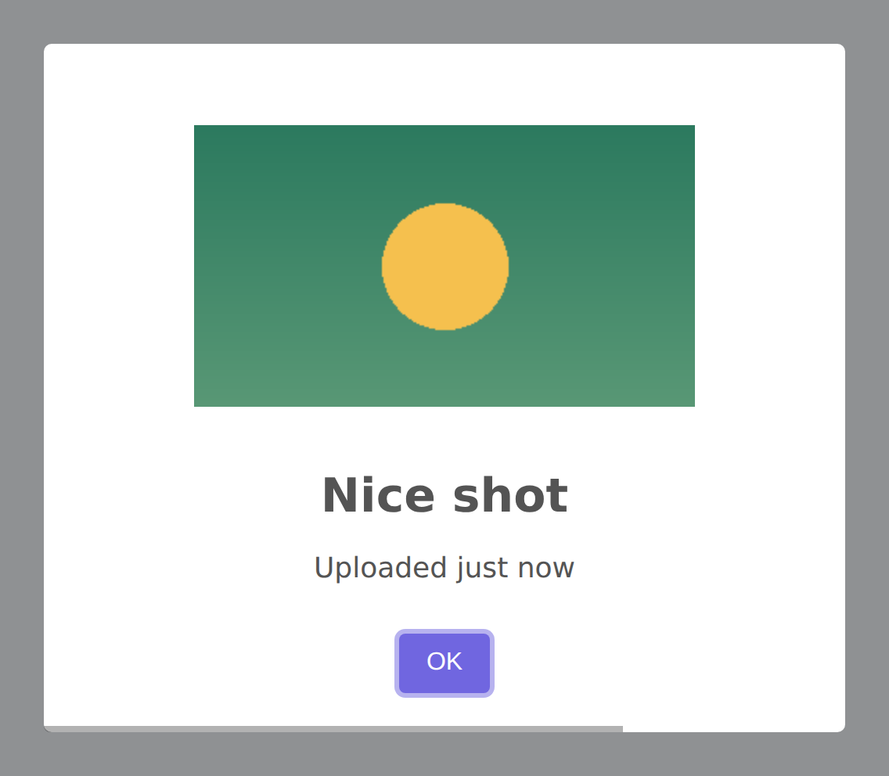

# Styling

The `HasStyling` trait provides fluent methods for customizing the visual appearance of your alerts — dimensions, colors, custom CSS classes, icons, images, and more.

## Dimensions

### Width

Set the modal width using any CSS value:




```php
Alert::title('Wide Alert')
    ->width('50rem')
    ->flash();

Alert::title('Narrow Alert')
    ->width('20rem')
    ->flash();

Alert::title('Percentage Width')
    ->width('80%')
    ->flash();
```

### Padding

Control the inner padding of the modal:

```php
Alert::title('Spacious')
    ->padding('2rem')
    ->flash();

Alert::title('Compact')
    ->padding('0.5rem')
    ->flash();
```

## Colors

### Background Color

```php
Alert::title('Dark mode')
    ->background('#1a1a2e')
    ->flash();
```

### Text Color

```php
Alert::title('Light text on dark')
    ->background('#1a1a2e')
    ->color('#e0e0e0')
    ->flash();
```

## Custom CSS Classes

Apply custom CSS classes to any part of the modal using `customClass()`. This merges with existing classes, so you can call it multiple times:

```php
Alert::title('Custom Styled')
    ->customClass([
        'container' => 'my-container',
        'popup' => 'my-popup',
        'header' => 'my-header',
        'title' => 'my-title',
        'closeButton' => 'my-close-btn',
        'icon' => 'my-icon',
        'image' => 'my-image',
        'content' => 'my-content',
        'input' => 'my-input',
        'actions' => 'my-actions',
        'confirmButton' => 'btn btn-primary',
        'cancelButton' => 'btn btn-secondary',
        'denyButton' => 'btn btn-warning',
        'footer' => 'my-footer',
    ])
    ->buttonsStyling(false)
    ->flash();
```

When using custom button classes (like Bootstrap or Tailwind), set `buttonsStyling(false)` to prevent SweetAlert2's default styles from conflicting.

### Merging Classes

Multiple `customClass()` calls merge their values:

```php
Alert::title('Merged Classes')
    ->customClass(['popup' => 'rounded-lg'])
    ->customClass(['confirmButton' => 'btn-primary'])
    ->flash();
// Result: both 'popup' and 'confirmButton' classes are set
```

## Icon Customization

### Custom Icon HTML

Replace the default icon with custom HTML — useful for Font Awesome or other icon libraries:

```php
Alert::title('Custom Icon')
    ->iconHtml('<i class="fas fa-rocket"></i>')
    ->flash();
```

### Icon Color

```php
Alert::title('Custom Color Icon')
    ->success()
    ->iconColor('#28a745')
    ->flash();
```

## Images

Add an image to the alert using `imageUrl()`. The image appears above the title:

```php
Alert::title('Product Preview')
    ->imageUrl('https://example.com/product.jpg')
    ->text('This is the new product.')
    ->flash();
```

### With Dimensions

```php
Alert::title('Product Preview')
    ->imageUrl('https://example.com/product.jpg', 400, 300)
    ->flash();
```

### Full Image Configuration

Use `addImage()` for complete control over dimensions and alt text:

```php
Alert::title('Product Preview')
    ->addImage('https://example.com/product.jpg', 400, 300, 'Product image')
    ->flash();
```

## Footer

Add HTML content to the footer area below the buttons:

```php
Alert::title('Terms Updated')
    ->info()
    ->footer('<a href="/terms">Read our updated terms of service</a>')
    ->flash();
```

## Backdrop

Control the backdrop overlay behind the modal. Accepts a boolean or a CSS color string:

```php
// No backdrop
Alert::title('No backdrop')
    ->backdrop(false)
    ->flash();

// Custom backdrop color
Alert::title('Red backdrop')
    ->backdrop('rgba(220, 53, 69, 0.4)')
    ->flash();

// Default backdrop (enabled)
Alert::title('Default backdrop')
    ->backdrop(true)
    ->flash();
```

## Grow Direction

Control how the popup grows when it contains dynamic content:

```php
Alert::title('Growing popup')
    ->grow('row')     // Grow horizontally
    ->flash();

Alert::title('Growing popup')
    ->grow('column')  // Grow vertically
    ->flash();

Alert::title('Growing popup')
    ->grow('fullscreen')  // Grow to fill screen
    ->flash();
```

## Height Auto

By default, SweetAlert2 sets the body height to auto when a modal is open. Disable this if it causes layout issues:

```php
Alert::title('Fixed height')
    ->heightAuto(false)
    ->flash();
```

## Escape Key and Outside Click

Control whether users can dismiss the dialog by pressing ESC or clicking outside:

```php
// Prevent ESC key from closing
Alert::title('Required action')
    ->allowEscapeKey(false)
    ->flash();

// Prevent clicking outside from closing
Alert::title('Must choose')
    ->allowOutsideClick(false)
    ->flash();

// Both disabled (fully persistent)
Alert::title('Cannot dismiss')
    ->allowEscapeKey(false)
    ->allowOutsideClick(false)
    ->flash();
```

## Stop Keydown Propagation

By default, SweetAlert2 stops keyboard events from propagating to the page. Disable this if you need keyboard events to pass through:

```php
Alert::title('Keyboard enabled')
    ->stopPropagation(false)
    ->flash();
```

## Complete Example: Dark Mode Alert

```php
use RealRashid\SweetAlert\Facades\Alert;

Alert::title('Welcome to Dark Mode')
    ->success()
    ->text('Your preferences have been saved.')
    ->background('#1e1e2e')
    ->color('#cdd6f4')
    ->width('28rem')
    ->padding('1.5rem')
    ->iconColor('#a6e3a1')
    ->customClass([
        'popup' => 'rounded-xl shadow-2xl',
        'confirmButton' => 'bg-green-600 hover:bg-green-700 text-white rounded-lg px-4 py-2',
        'title' => 'text-xl font-semibold',
    ])
    ->buttonsStyling(false)
    ->showCloseButton()
    ->backdrop('rgba(0, 0, 0, 0.7)')
    ->flash();
```

## Title Text

Set the title as plain text (bypasses HTML rendering). Use instead of `title()` when the content is user-supplied and should not be treated as HTML:

```php
Alert::info()
    ->titleText('Welcome, ' . $user->name)
    ->flash();
```

## Target Element

Render the modal inside a specific DOM element instead of the `<body>`. Accepts a CSS selector string:

```php
Alert::title('In a container')
    ->target('#my-modal-host')
    ->flash();
```

## Top Layer

Render the dialog in the browser's top-layer (above everything, including `position: fixed` elements). Useful for apps with complex z-index stacking:

```php
Alert::title('Top layer alert')
    ->topLayer()
    ->flash();
```

Pass `false` to disable:

```php
Alert::title('Normal layer')
    ->topLayer(false)
    ->flash();
```

## Scrollbar Padding

Prevent layout shift when the modal opens by automatically adding body padding to compensate for the removed scrollbar. Enabled by default; disable if it causes issues:

```php
Alert::title('No padding compensation')
    ->scrollbarPadding(false)
    ->flash();
```

## Draggable

Make the modal draggable by the user:

```php
Alert::title('Move me around')
    ->info()
    ->draggable()
    ->flash();
```

Disable explicitly:

```php
Alert::title('Locked position')
    ->draggable(false)
    ->flash();
```

## Loader HTML

Customize the HTML shown inside the loader spinner (displayed during `showLoaderOnConfirm`):

```php
Alert::confirm('Processing...')
    ->showLoaderOnConfirm()
    ->loaderHtml('<div class="my-spinner"></div>')
    ->flash();
```

## Close Button HTML

Replace the default "X" close button with custom HTML:

```php
Alert::title('Custom close')
    ->showCloseButton()
    ->closeButtonHtml('<span class="text-red-500">&times;</span>')
    ->flash();
```
