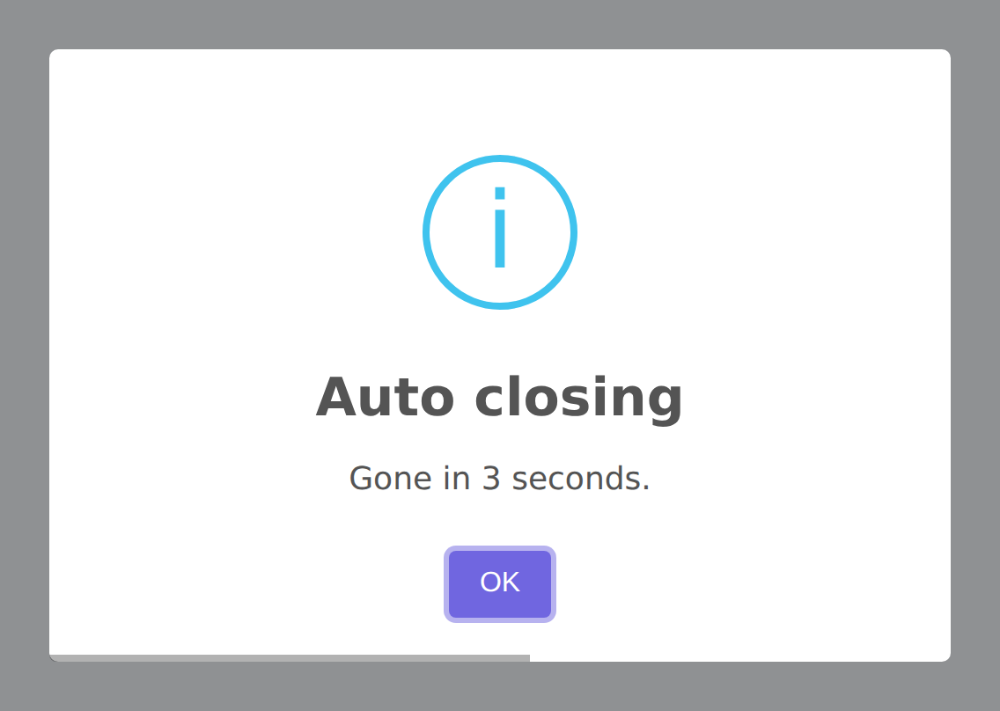

# Timer & Persistence

The `HasTimer` trait provides methods for controlling auto-close behavior, progress bars, and dialog persistence. These options determine how long an alert stays visible and how users can dismiss it.

## Auto-Close Timer

Set the auto-close timer in milliseconds. The dialog will automatically close when the timer expires:




```php
Alert::title('Auto-closing alert')
    ->success()
    ->timer(3000)  // Close after 3 seconds
    ->flash();
```

### `autoClose()` Alias

`autoClose()` is an alias for `timer()`. Use whichever reads better in your context:

```php
Alert::toast('Saved!', 'success')
    ->autoClose(3000)
    ->flash();
```

## Timer Progress Bar

Show a visual progress bar at the bottom of the popup that counts down the remaining time:

```php
Alert::toast('Saving...', 'info')
    ->timer(5000)
    ->timerProgressBar()
    ->flash();
```

The progress bar is enabled by default for toast notifications but disabled for modal alerts. You can explicitly disable it:

```php
Alert::toast('No progress bar', 'info')
    ->timerProgressBar(false)
    ->flash();
```

### Customizing the Progress Bar

The progress bar can be styled using the `customClass` option with the `timerProgressBar` key in your CSS:

```css
.swal2-timer-progress-bar {
    background: rgba(40, 167, 69, 0.6);
    height: 4px;
}
```

## Persistent Dialogs

Make a dialog persistent — it cannot be dismissed by the timer, ESC key, or clicking outside:

```php
Alert::title('Important!')
    ->warning()
    ->text('You must read this carefully before proceeding.')
    ->persistent()
    ->flash();
```

The `persistent()` method:
- Removes the auto-close timer
- Disables the ESC key (`allowEscapeKey = false`)
- Disables outside click dismiss (`allowOutsideClick = false`)
- Shows the confirm button by default

### Persistent with Close Button

Show a close button alongside the confirm button for persistent dialogs:

```php
Alert::title('Please confirm')
    ->persistent(showConfirmBtn: true, showCloseBtn: true)
    ->flash();
```

### Persistent Without Buttons

If you want the dialog to persist but only be closable programmatically:

```php
Alert::title('Processing...')
    ->persistent(showConfirmBtn: false, showCloseBtn: false)
    ->showLoaderOnConfirm()
    ->flash();
```

## Timer Interaction with Buttons

When you call `showConfirmButton()`, `showCancelButton()`, or `showDenyButton()`, the auto-close timer is automatically removed. This is because buttons require user interaction — it wouldn't make sense to auto-close a dialog that's waiting for a button click.

```php
Alert::title('Choose an option')
    ->warning()
    ->showCancelButton()  // Timer is removed automatically
    ->flash();
```

If you want both buttons and a timer, set the timer after the button methods:

```php
Alert::title('Hurry up!')
    ->warning()
    ->showCancelButton()
    ->timer(10000)  // Timer set after button — this works
    ->timerProgressBar()
    ->flash();
```

## Default Timer Values

| Alert Type | Default Timer | Source |
|---|---|---|
| Modal alerts | 5000ms | `config('sweetalert.timer')` |
| Toast notifications | 5000ms | `config('sweetalert.toast.auto_close')` |
| Confirm dialogs | None | No timer (requires user action) |
| Delete confirmations | None | No timer (requires user action) |

## Real-World Examples

### Quick Auto-Closing Success Toast

```php
Alert::toast('Profile updated', 'success')
    ->autoClose(2000)
    ->timerProgressBar()
    ->position('bottom-end')
    ->flash();
```

### Important Persistent Warning

```php
Alert::title('Terms of Service Update')
    ->warning()
    ->text('You must accept the new terms to continue using the service.')
    ->persistent(showCloseBtn: true)
    ->confirmButton('I Accept', '#28a745')
    ->footer('<a href="/terms">Read the full terms</a>')
    ->flash();
```

### Timed Confirmation

```php
Alert::title('Session Expiring')
    ->warning()
    ->text('Your session will expire in 30 seconds. Click to extend.')
    ->timer(30000)
    ->timerProgressBar()
    ->confirmButton('Extend Session', '#3085d6')
    ->showCancelButton('Log out now', '#dc3545')
    ->flash();
```

## Stop Keydown Propagation

By default, SweetAlert2 stops keyboard events from propagating to the rest of the page while the dialog is open. Disable this if you need keyboard events to pass through (e.g., when the dialog hosts a custom component that listens for keyboard input):

```php
Alert::title('Keyboard pass-through')
    ->stopKeydownPropagation(false)
    ->flash();
```

## Keydown Listener Capture Phase

Control whether SweetAlert2's internal keydown listener runs in the capture phase. Enable capture-phase listening when another listener on the page intercepts events before they reach SweetAlert2:

```php
Alert::title('Capture phase')
    ->keydownListenerCapture()
    ->flash();
```

Pass `false` to restore the default bubble-phase behavior:

```php
Alert::title('Bubble phase')
    ->keydownListenerCapture(false)
    ->flash();
```
