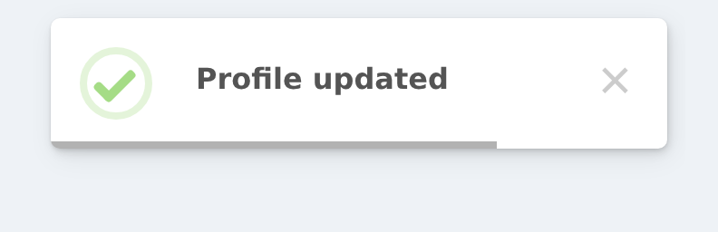

# Toast Notifications

Toasts are lightweight, non-blocking notifications that appear in a corner of the screen and auto-dismiss after a set time. The `ToastBuilder` is a purpose-built builder with toast-specific defaults that make creating toast notifications effortless.

## Creating a Toast

Use the `toast()` method on the `Alert` facade to create a toast. The first argument is the message, and the optional second argument is the icon type:




```php
use RealRashid\SweetAlert\Facades\Alert;

// Simple toast
Alert::toast('Saved successfully!', 'success')->flash();

// Toast with icon
Alert::toast('Something went wrong', 'error')->flash();
```

## Toast Defaults

The `ToastBuilder` automatically applies sensible defaults for toast notifications, so you don't need to configure them manually:

| Setting | Default | Why |
|---|---|---|
| `toast` | `true` | Marks this as a toast (not a modal) |
| `position` | `top-end` | Top-right corner for standard toasts |
| `showCloseButton` | `true` | Users can dismiss manually |
| `showConfirmButton` | `false` | No need for a confirm button on toasts |
| `timerProgressBar` | `true` | Visual countdown indicator |
| `timer` | `5000` | Auto-close after 5 seconds |

All defaults come from `config/sweetalert.php` and can be customized there.

## Icon Methods

Just like `AlertBuilder`, `ToastBuilder` provides convenience icon methods:

```php
Alert::toast('Operation complete', 'success')->flash();
Alert::toast('An error occurred', 'error')->flash();
Alert::toast('Be careful', 'warning')->flash();
Alert::toast('For your information', 'info')->flash();
Alert::toast('Do you want to continue?', 'question')->flash();
```

You can also chain the icon method after creating the toast:

```php
Alert::toast('Profile updated')
    ->success()
    ->flash();
```

## Positioning

Change the toast position using `position()` with a string or the `Position` enum:

```php
use RealRashid\SweetAlert\Enums\Position;

Alert::toast('Saved!', 'success')
    ->position('bottom-end')
    ->flash();

Alert::toast('New message', 'info')
    ->position(Position::BottomStart)
    ->flash();
```

### Quick Position Methods

The `ToastBuilder` also provides shorthand position methods that eliminate the need to remember string values:

```php
Alert::toast('Top right', 'success')->topEnd()->flash();
Alert::toast('Bottom right', 'success')->bottomEnd()->flash();
Alert::toast('Top left', 'success')->topStart()->flash();
Alert::toast('Bottom left', 'success')->bottomStart()->flash();
Alert::toast('Top center', 'success')->top()->flash();
Alert::toast('Bottom center', 'success')->bottom()->flash();
Alert::toast('Center', 'success')->center()->flash();
```

## Auto-Close Timer

Control how long the toast stays visible using `autoClose()` or `timer()`:

```php
// Close after 3 seconds
Alert::toast('Quick update', 'success')
    ->autoClose(3000)
    ->flash();

// Close after 10 seconds
Alert::toast('Important notice', 'warning')
    ->autoClose(10000)
    ->flash();

// Disable auto-close (user must dismiss manually)
Alert::toast('Read carefully', 'info')
    ->persistent(showCloseButton: true)
    ->flash();
```

## Timer Progress Bar

The progress bar shows a visual countdown at the bottom of the toast. It's enabled by default, but you can disable it:

```php
// Disable progress bar
Alert::toast('No progress bar', 'success')
    ->timerProgressBar(false)
    ->flash();
```

## Customizing Close Button

By default, toasts show a close button. You can customize or hide it:

```php
// Hide the close button
Alert::toast('Auto-dismiss only', 'info')
    ->hideCloseButton()
    ->flash();

// Custom aria label for accessibility
Alert::toast('Accessible toast', 'success')
    ->showCloseButton('Dismiss notification')
    ->flash();
```

## Styling Toasts

Apply custom CSS classes, background colors, and other visual customizations:

```php
Alert::toast('Dark mode toast', 'success')
    ->background('#1a1a2e')
    ->color('#e0e0e0')
    ->customClass([
        'popup' => 'my-toast-popup',
        'title' => 'my-toast-title',
    ])
    ->flash();
```

## Toast Hidden Behind a Navbar

A toast lives in SweetAlert2's own container, which sits at a fixed
`z-index`. If your layout has a header, sidebar or modal with a higher one, the
toast renders *underneath* it and looks like it never appeared.

`topLayer()` moves the popup into the browser's top layer, which is painted
above every element on the page no matter what `z-index` they use:

```php
Alert::toast('Saved', 'success')->topLayer()->flash();
```

This is the fix whenever a toast "does not show" but you can find it in the
DOM — it was there all along, just behind something. It works for modals too.

## Animation

Add entrance and exit animations using Animate.css classes:

```php
Alert::toast('Animated!', 'success')
    ->animation('animate__slideInRight', 'animate__slideOutRight')
    ->flash();
```

## Real-World Examples

### After Form Submission

```php
public function store(Request $request)
{
    Post::create($request->validated());

    Alert::toast('Post created successfully!', 'success')
        ->position('bottom-end')
        ->autoClose(3000)
        ->flash();

    return redirect()->route('posts.index');
}
```

### After Deletion

```php
public function destroy(Post $post)
{
    $post->delete();

    Alert::toast('Post deleted', 'warning')
        ->flash();

    return back();
}
```

## Using the `toast()` Helper

The global `toast()` helper function provides a convenient shortcut:

```php
toast('Item added to cart', 'success')->flash();
toast('Operation failed', 'error')->autoClose(5000)->flash();
```

This is functionally identical to `Alert::toast()` — it's just shorter and more convenient for simple cases.
