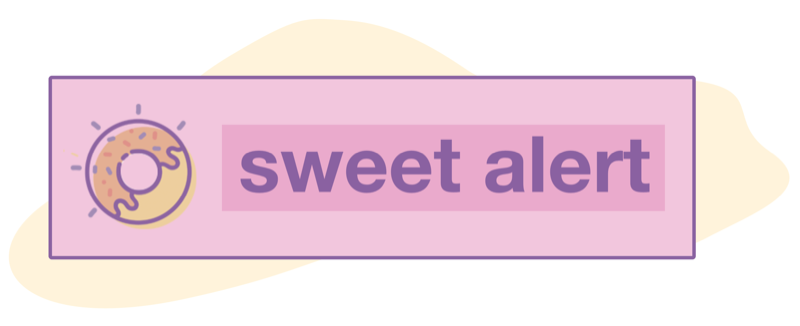

<p align="center">
  <a href="https://realrashid.github.io/sweet-alert/">
    
  </a>
</p>
<p align="center">
A BEAUTIFUL, RESPONSIVE, CUSTOMIZABLE, ACCESSIBLE (WAI-ARIA) REPLACEMENT FOR JAVASCRIPT'S POPUP BOXES FOR LARAVEL
</p>
<p align="center">
    
</p>

<p align="center">
<a href="https://packagist.org/packages/realrashid/sweet-alert" target="_blank"></a>
<a href="https://packagist.org/packages/realrashid/sweet-alert" target="_blank"></a>
<a href="https://www.patreon.com/realrashid" target="_blank"></a>
<a href="https://packagist.org/packages/realrashid/sweet-alert" target="_blank"></a>
</p>

# Install

To get started with SweetAlert2, use Composer to add the package to your project's dependencies:

```
composer require realrashid/sweet-alert
```
<br>
<h3 align="center">
    <a href="https://realrashid.github.io/sweet-alert" target="_blank">Documentation</a>
</h3>
<br>

<br>
<h3 align="center">
    <a href="https://github.com/sweetalert2/sweetalert2" target="_blank">Checkout the Js Library</a>
</h3>
<br>

## Sponsors
Support this project by becoming a sponsor. Your logo will show up here with a link to your website.
[[Become a sponsor](https://opencollective.com/sweet-alert#sponsor)]

<a href="https://www.git-zen.com/?utm_source=https://github.com/realrashid/sweet-alert&utm_medium=github&utm_campaign=sweet-alert" target="_blank"></a>

## ❤️ Open-Source Software - Give ⭐️

I have included the awesome `symfony/thanks` composer package as a dev
dependency.
Let your OS package maintainers know you appreciate them by starring
the packages you use.
Simply run `composer thanks` after installing this package.
(And not to worry, since it's a dev-dependency it won't be installed in your
live environment.)

## License

SweetAlert2 is open-sourced software licensed under the MIT License (MIT). Please see [License File](LICENSE.md) for more information.

<p align="center"> <b>Made ❤️ with Pakistan<b> </p>

> note: if you are using sweet-alert v1.0 you can get README for v1.0 from [here](https://github.com/realrashid/sweet-alert/blob/1.0/readme.md)
